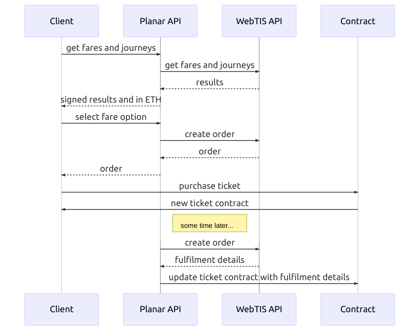

# WebTIS Integration Guide

The Planar Network ERC-721 ticket wallet integrates with an off-chain WebTIS in order to issue rail tickets compliant with RSP standards. 

The overall integration process is as follows:

